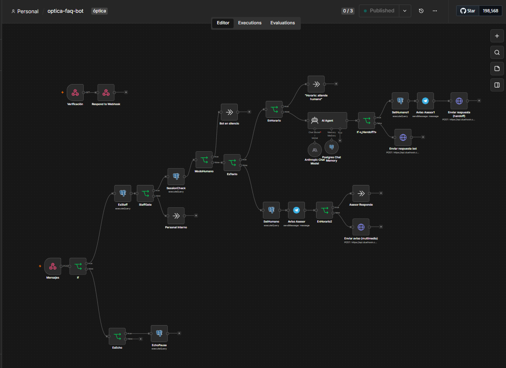
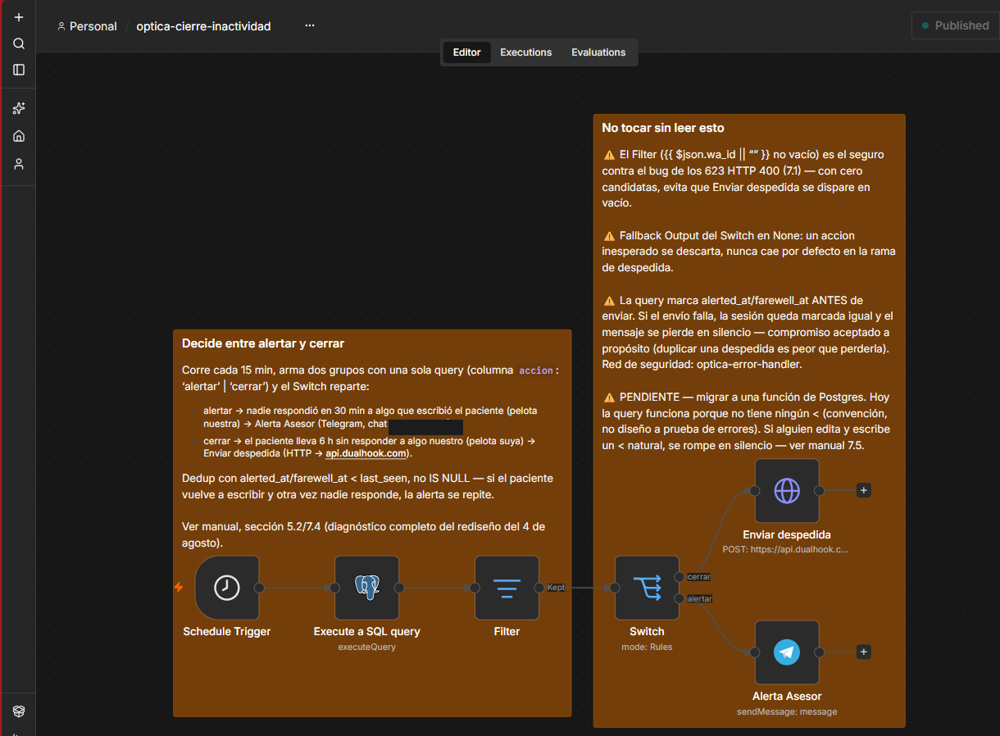
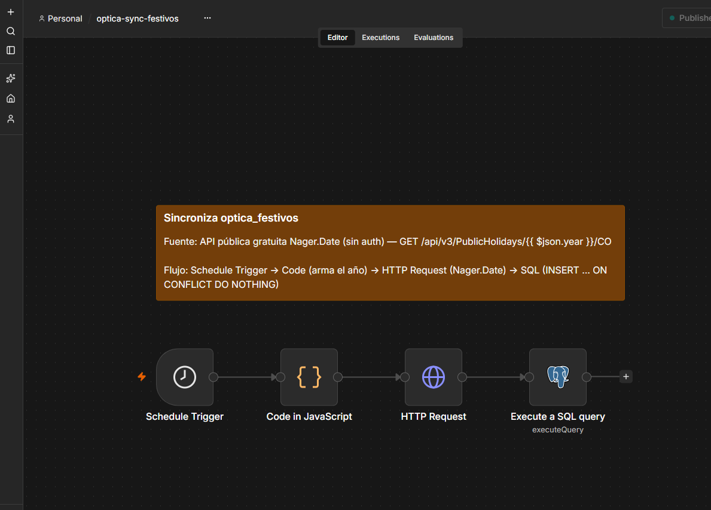
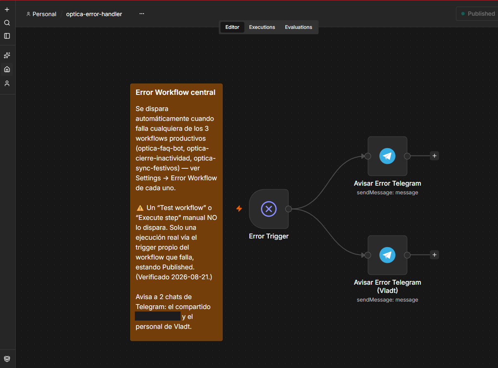

# 🦉 optica-bot-stack — Owly, a WhatsApp assistant for an optical shop

[🇪🇸 Español](README.md) · **🇬🇧 English**

> ℹ️ Client details (business name, address, phone number and staff) have been **anonymized** in this documentation. The architecture, the code and the lessons are the real ones.

A **production** WhatsApp bot for a real optical shop in Colombia. It serves patients on the **company's official phone number** through **Coexistence** (the WhatsApp Business app and the Cloud API share the same number): the human team answers from the app during business hours, and **Owly** 🦉 —the AI assistant— takes over when the shop is closed.

> A real project, with a real client, running 24/7 on a single ARM EC2 instance. This README documents the architecture, the design decisions and —above all— the **war log of real problems** found and fixed on the way to production.

---

## Architecture

```
Patient (WhatsApp) ⇄ Meta Cloud API
                          │  webhooks (direct, Webhook Override)
                          ▼
      Caddy (HTTPS, own domain) ─→ n8n (4 workflows)
                                      │
              ┌───────────────────────┼──────────────────────────┐
              ▼                       ▼                          ▼
      Postgres (pgvector)      Claude Haiku 4.5           Telegram Bot API
      · chat memory            (Anthropic API)            · human handoff
      · session state          conversational brain       · unanswered patient
      · staff list                                        · workflow failures
      · public holidays
                          outbound replies
                                      │
                                      ▼
                     Dualhook (BSP · api.dualhook.com) ─→ Meta ─→ Patient
```

- **Infrastructure:** AWS EC2 **t4g.small (ARM/Graviton, 2 GiB)** · Ubuntu arm64 · Docker Compose (Caddy + n8n + Postgres/pgvector) · 30 GB gp3 volume · **own domain** with automatic TLS (migrated off sslip.io with no downtime — see the war log) · SSM Session Manager access (no SSH). The project started on a t3.micro; the move to ARM is in Phase 5.
- **Coexistence:** [Dualhook](https://dualhook.com) (Meta Tech Partner) enables Embedded Signup and **Webhook Override**: inbound messages go **straight from Meta to n8n** (Dualhook never stores message content); outbound goes through Dualhook's API with a connection-scoped key.
- **Free inbound:** the bot only replies inside Meta's 24-hour customer service window (patient-initiated conversations) → messaging cost ≈ $0 at this volume.

## What the bot does

| Area | Detail |
|---|---|
| **Identity** | Always introduces itself as *Owly, the virtual assistant* — never pretends to be a human or a clinical professional. |
| **FAQ** | Hours, prices, brands, payment methods, location — strictly from a curated knowledge base (no hallucinated facts). |
| **Clinical guardrail** | Unbreakable rule: never diagnoses or comments on symptoms; always refers to an in-person consultation. |
| **Appointments** | Validates date/time against real slots (including the midday closure and the "last appointment one hour before closing" rule, with the current date injected in `America/Bogota`). **It does not book**: it registers the request and a human agent confirms. |
| **Data capture** | Booking form with a **link to the privacy policy BEFORE asking for any data** (Colombian Law 1581). Distinguishes new vs. existing patients. No sensitive health data over chat (e.g. blood type → collected in person). |
| **Per-patient memory** | History in Postgres keyed by phone number, with **expiring sessions**: `new` / `returning` / `continuing` (session-key rotation → a patient returning months later doesn't drag stale context). |
| **Human handoff** | Escalates on: media (prescriptions, payment receipts), an explicit request for a human, or status questions only the team can answer (a `##HANDOFF##` marker emitted by the LLM and detected in n8n). Alerts via **Telegram** and pauses the bot for 24 h **for that patient only**. |
| **Anti-collision (echo pause)** | If a human replies from the app, the echo webhook pauses the bot for 2 h for that patient. Bot and agent never talk over each other. |
| **Business-hours gate** | The bot only converses **outside business hours**; during business hours the team answers from the app (Telegram alerts stay on at all times). |
| **Automatic public holidays** | Colombia's 18 public holidays sync themselves from the public **Nager.Date** API, with the Ley Emiliani shifts already applied (verified in production: Assumption 2026 arrived as Monday 17 August, not Saturday the 15th). A holiday counts as a closed day: the bot **does answer** (the team isn't there) and **never books** appointments on that date. Zero manual upkeep. |
| **Whose turn is it** | Every 15 minutes a workflow compares `last_seen` against `last_outbound_at` and decides: if the ball is **ours** and has been sitting for 30 minutes, it alerts the team on Telegram; if the ball is **the patient's** and has been sitting for 6 hours, it sends the goodbye and closes the session. One query decides both paths. |
| **Failure alerts** | A central *Error Workflow* catches any exception from the three production workflows and pushes it to Telegram with the failing node, the message and a direct link to the execution. Before that, a broken cron was discovered by luck. |
| **Internal staff** | Team phone numbers live in an `optica_staff` table (Postgres, **kept out of the repo** for privacy) → the bot ignores them entirely. |
| **WhatsApp formatting** | Style rule plus a programmatic `**`→`*` sanitizer so bold renders correctly in WhatsApp. |

## Data model (Postgres)

```sql
optica_chat_history   -- conversational memory (n8n Postgres Chat Memory), keyed by the rotating session key "wa_id:N"
optica_sessions       -- per-patient state: first_seen, last_seen, last_outbound_at, visit_count, current_session,
                      --   mode (bot|human), handoff_until, alerted_at, farewell_at, wa_user_id (Meta BSUID)
optica_staff          -- internal numbers the bot ignores (privacy: they live in the DB, not in the workflow or the repo)
optica_festivos       -- Colombian public holidays (date PK, name); auto-populated from Nager.Date
```

`SessionCheck` is a single query that does all the state work: session upsert, `new/returning/continuing` detection, session-key rotation, `human_active`, `es_festivo` and the list of upcoming holidays. One source of truth for both the gates and the prompt.

## n8n workflows

1. **`optica-faq-bot`** (main): Webhook (GET verification + POST messages) → filter (real message + not an echo + not staff) → `SessionCheck` → human-mode gate → text/non-text gate → business-hours gate → **AI Agent** (Claude Haiku 4.5 + Postgres Chat Memory) → `##HANDOFF##` detection → send via Dualhook. Parallel branches: media escalation and echo pause.
2. **`optica-cierre-inactividad`**: Schedule every 15 min → one query that classifies every session as `alertar` or `cerrar` → `Switch` → Telegram (patient unanswered for 30 min) or goodbye via Dualhook (patient silent for 6 h). The two thresholds measure deliberately different things; see Phase 5 of the war log.
3. **`optica-sync-festivos`**: Monthly schedule → Code (current year + next) → HTTP Request to `date.nager.at` → idempotent upsert into `optica_festivos`. Monthly rather than yearly on purpose: if one run fails, it self-heals the following month.
4. **`optica-error-handler`**: `Error Trigger` → Telegram. It has no trigger of its own: n8n invokes it whenever any of the three workflows above throws (Settings → Error Workflow). It is the only reason anyone finds out about an overnight failure.

All four carry **sticky notes on the canvas itself** documenting each branch and the known traps: the ops manual isn't always within reach when something breaks at 2 a.m.

### Canvas screenshots

| Workflow | View |
|---|---|
| `optica-faq-bot` |  |
| `optica-cierre-inactividad` |  |
| `optica-sync-festivos` |  |
| `optica-error-handler` |  |

## What's (and isn't) in this repository

This repository is **architecture documentation**, not a ready-to-run deployment.

**It includes:** this README, an example version of the system prompt (`docs/system_prompt_bot.example.md`), the infrastructure config (`docker-compose.yml`, `Caddyfile`), the database migrations and screenshots of the workflows.

**It deliberately does not include:** the workflow JSONs with real configuration, credentials, tokens, phone numbers or the client's knowledge base. Those live in a private repository and on the server. This public repo **is not a backup**: backups are EBS snapshots and Postgres dumps kept outside Git.

## Security and privacy

- **Permanent** Meta System User token (no more 24-hour tokens).
- The LLM **never writes SQL**: every query goes through parameterized Postgres nodes.
- Public privacy policy (HTTPS via GitHub Pages) compliant with **Colombian Law 1581 of 2012** and Decree 1377: identified data controller, sensitive data, minors, response deadlines for requests and complaints. Informed consent **before** any data capture.
- Dualhook runs a **zero message storage** architecture (webhooks routed directly from Meta to our own server).
- Staff numbers and credentials stay out of the repository (DB + n8n credentials).
- A deliberate split between **portfolio** (this public, anonymized repo) and **operations** (private repo + server). One artifact cannot be both a showcase and a backup.

---

## 🪖 War log: real problems and how they were fixed

Documenting what went wrong is worth more than documenting what went right. All of this actually happened.

### Phase 1 — Infrastructure and Cloud API
| Problem | Root cause | Fix |
|---|---|---|
| Let's Encrypt failing with DuckDNS | Inconsistent global DNS resolution | Move to **sslip.io** (always resolves to the embedded IP) |
| Disk full during `docker pull` on t3.micro | 8 GB default volume + heavy images | `growpart` + `resize2fs` to 30 GB + a 2 GB swapfile |
| n8n webhook wouldn't self-register | Auto-registration is unreliable | **Two manual webhook nodes** (GET verification + POST messages) sharing the same path |
| Meta wasn't delivering messages to the webhook | The WABA was subscribed to Meta's internal app, not ours | Manual `POST` to `subscribed_apps` with the correct app |
| Persistent "Prompt required" error in n8n | The prompt field requires picking "Define below" before it accepts expressions | Select the field mode **before** pasting the expression |
| The bot died every 24 hours | Meta temporary token | **System User** with a non-expiring token (does not require business verification) |

### Phase 2 — Memory and intelligence
| Problem | Root cause | Fix |
|---|---|---|
| Basic LLM Chain doesn't support memory | By design: "None of the chain nodes support memory" (n8n docs) | Migrate to the **AI Agent** node + **Postgres Chat Memory** sub-node |
| `localhost` in the Postgres credential wouldn't connect | Inside the container, localhost = n8n itself | Use the compose **service name** (`postgres`) as the host |
| Outbound message went empty after moving to AI Agent | The chain returns `text`; the Agent returns `output` | Update the reference in the send node |
| Repeated greetings / stale context from months ago | Flat memory keyed only by phone number | **Expiring sessions** with session-key rotation (`wa_id:N`) + new/returning/continuing states |
| The bot accepted appointments at 1:00 p.m. | It knew neither today's date nor the midday closure | Inject `$now` in the Bogotá timezone into the prompt + explicit valid start-time ranges |
| Patients thought they were talking to the eye-care professional | The bot never identified itself | Mandatory **Owly** identity in greetings + never impersonate a human |
| "An agent will reply *right away*" (false after hours) | Over-optimistic prompt wording | Rule: never promise a response time; fixed phrasing "as soon as possible" |
| The bot said "I'll book you in" (it can't book) | Ambiguous prompt | Rule: the bot **only registers the request**; a human agent confirms availability and books |

### Phase 3 — Coexistence (the saga)
| Problem | Root cause | Fix |
|---|---|---|
| Coexistence isn't available in Meta's panel for first-party apps | Meta gates it behind a **BSP/Tech Partner Embedded Signup** | Evaluate BSPs → pick **Dualhook** ($12/mo, webhook override, no message storage, cancel anytime) |
| "Add phone number" in the developer panel asked for an OTP | That flow is **migration** (it removes the number from the app), not coexistence | Abort and use only the BSP's Embedded Signup |
| Meta's popup completed but Dualhook showed "0 connections" (×2) | The browser blocked the *handoff* back from the popup to the original tab | See next row 👇 |
| Retry failed with `#2388002` (eligibility) | The number was left **half-connected** from the previous attempt | **Disconnect the platform connection in the app** → wait 15 min → retry |
| The handoff still failed in a "clean" Firefox | Firefox's **Total Cookie Protection** breaks cross-site OAuth even with the shield off for the site | **Chromium browser (Edge)** + **McAfee WebAdvisor disabled** + third-party cookies + popups allowed + original tab left open → ✅ on the third attempt |
| BSP websites appearing "down" only on this PC | McAfee (WebAdvisor/VPN) blocking the domains | Diagnose with a clean hosts file + an external check; disable/restart. *Moral: verify from another network before writing off a vendor* |
| The bot received but didn't reply (post-migration) | The HTTP Request JSON field got a JS object → `[object Object]` | Wrap the body in **`JSON.stringify(...)`** |
| Still not valid JSON | A stray `=` at the start of the expression (the field was already in expression mode) | Remove the literal `=` |
| The bot was replying to the human agent | **Echoes** (messages sent by the business itself) arrived as inbound messages | Filter `from ≠ business number` + a separate echo branch |
| `EchoPausa` failed with "no parameter $1" | `statuses` events (with no phone number) also reached that branch | An `EsEcho` gate (`Array.isArray(value.message_echoes)`) before the UPDATE |
| Meta health showed "BLOCKED" for sending | A payment-method error on the WABA (blocks only **business-initiated templates**) | Doesn't affect service replies (the current use case); payment method added later |

### Phase 4 — Refinement under real usage
| Problem | Root cause | Fix |
|---|---|---|
| Bot and human agent colliding in the same conversation | Both active at once | **Business-hours gate** (bot only while the shop is closed) + a 2 h **echo pause** per patient |
| Bold text showing literal asterisks (`*text*`) | The LLM emitted Markdown `**`, which WhatsApp doesn't render | WhatsApp formatting rule in the prompt + `replace(/\*\*/g,'*')` sanitizer on send |
| The bot replied to the shop's own staff | Their personal numbers looked like any patient's | **`optica_staff`** table in Postgres (numbers out of the repo) + a gate at the very start of the flow |
| Conversations stayed "open" forever | No close-out policy | **Goodbye-after-one-hour-of-inactivity** workflow (once only, tracked via `farewell_at`). *Redesigned in Phase 5: one hour without asking whose turn it was turned out to be the next problem* |
| Risk of leaking personal phone numbers in the repo | Numbers hardcoded in workflow conditions | Move the list to the DB; add a secret-scanning checklist before publishing the JSON |
| **Public holidays: the worst kind of silent failure** | The hours gate only looked at weekday and time → a holiday was treated as a working day: the bot stayed silent **and** the team wasn't there → the patient got no answer at all | `optica_festivos` table + `es_festivo` in `SessionCheck` + `&& !es_festivo` in both gates |
| Owly didn't announce the holiday even after the gate worked | It was handed a *list* of dates and expected to work out whether today was in it (date arithmetic = fragile). On top of that, the test holiday was literally named "TEST — delete" and the model dismissed it as an artifact | Inject an **explicit flag** `IS TODAY A HOLIDAY?: YES/No` from the DB boolean + instruct the model to trust it even if the name looks like a test |
| Yearly holiday maintenance (easy to forget) | Manually curated list, year after year | Sync workflow using **Nager.Date** (public API, no auth) → self-feeding forever |
| Suspected bug when the flow died at "Bot silent" | Gates run in series: the first one that applies short-circuits the flow (a per-patient pause wins before the hours gate is even evaluated) | Not a bug — defense in depth. The `human_active` value in `SessionCheck`'s output explains every path |

### Phase 5 — Audit and observability (August 2026)

The phase where we stopped fixing what broke and started hunting for what was breaking **silently**.

| Problem | Root cause | Fix |
|---|---|---|
| **The anti-collision guard had never worked in production.** Every time an agent replied from the app, Owly kept answering in parallel | Meta is migrating to **Business-Scoped User IDs**: the echo payload carries `to_user_id` and the phone number (`to`) may simply not be there. The `UPDATE` matched on phone only → it affected **0 rows and raised no error** | A `wa_user_id` column + matching on the BSUID with the phone as fallback: `WHERE wa_user_id = $1 OR ($2 != '' AND wa_id = $2)`. Later confirmed against 6 real executions (1 row affected in every one) |
| Three more nodes carried the same exposure and nobody knew | The pattern had been fixed **twice reactively**: only the node that blew up each time | Export every workflow (`n8n export:workflow --all`) and review **all** Postgres nodes with `jq`, not just the suspects. Three untouched ones turned up |
| 🔴 **A query was executing differently from what the editor showed** | Something between n8n's editor and execution runs an HTML tag stripper (a hand-rolled `<[^>]*>`) and **deletes everything between a `<` and the next `>`**. The editor keeps showing the full text | Rewrite the queries with **no `<` at all** (`a < b` ≡ `b > a`). In SQL that also forces `!=` instead of the natural `<>`, which starts with `<` and would be swallowed whole |
| "Flip every `<`" nearly deleted half of `SessionCheck` | The stripper needs a **pair**: an opening `<` and a closing `>`. A query with a `<` and no later `>` is harmless — and adding a `>=` "to be safe" hands it exactly the closing bracket it was missing | The rule isn't *flip the `<`*, it's **make sure no `<…>` pair exists**. Count `<` and `>` in order of appearance before touching a node. *A mitigation applied without understanding the mechanism can trigger the very thing it was meant to prevent* |
| An edited expression was silently corrupted, with no error | Pasting `={{ ... }}` into a field the UI already has in *Expression* mode leaves that `=` as a literal character, and n8n adds its own on save → the exported JSON reads `"=={{ ... }}"` | Re-export and diff the JSON against a known-good node after every edit. *"It looks right in the editor" is not verification* |
| The inactivity close-out was saying goodbye to patients who were waiting for an answer | The 1-hour threshold measured "nothing happened", without distinguishing **whose turn it was** | A two-path redesign over a single query: `alertar` at 30 min if the ball is ours, `cerrar` at 6 h if it's the patient's |
| A 25-minute outage was caught only because someone happened to be looking at the screen | n8n doesn't notify anyone when a workflow fails | A central **Error Workflow** → Telegram with the workflow, the failing node, the message, the time in Bogotá and a direct link to the execution |
| The Error Workflow "didn't work": testing it produced nothing | Manual executions (`Execute step`, `Test workflow`) **do not trigger it**. Only a real execution through the workflow's own trigger, while *Published* | Test it with a throwaway one-node workflow (`Code` with `throw new Error(...)`) fired from its **production URL**, not from the editor |
| Moving the machine while the hostname lived on `sslip.io` was a gamble | Let's Encrypt can't validate the new hostname until the IP already points there, and the limit of 5 certificates per hostname per 168 h can leave the bot down for a week | Move to an **own domain before you need it**: an A record (in *DNS only* — the proxy breaks the HTTP-01 challenge) + an extra block in the `Caddyfile` → both domains serve at once and the cutover happens once real traffic has confirmed it |
| The t3.micro ran out of headroom with **a single client** | 605 MB of RAM used out of 909 MB available plus 542 MB in swap: the working set was around 1.15 GB against 1 GiB of physical memory | Migrate to **t4g.small (ARM/Graviton, 2 GiB)**. The quicker `stop → change type → start` onto a t3.small was rejected on purpose — see the next row 👇 |
| Backups had been running for months and **not one had ever been restored** | Three artifacts landed in S3 every night. Nobody had ever rebuilt anything from them: an unverified backup is a hypothesis, not a safety net | The long path (new instance + full restore) was chosen precisely to **force that verification** while the only client is an in-house one. First restore ever proven in the project's history |
| 🔴 Three broken IAM permissions, all found on the same day | All three the same pattern: configured **reactively**, only for the use case that existed at the time. The SSM policy pinned by ARN to the old instance; the S3 role with write access but no `s3:GetObject`; the SSM policy missing the `AWS-StartPortForwardingSession` document | None of them was a security hole — least privilege was doing exactly its job — but each was an **availability risk that stayed invisible until it mattered**. They only surface when you exercise new paths |
| The TLS certificate could have left the bot down for a week mid-migration | Let's Encrypt + a hostname tied to the IP (see two rows above) | Avoided **at the root**: the own domain had been migrated the day before. Phase 0 existed precisely so that this step would be boring |
| 🔴 The migration finished "clean" and left a time bomb behind | The cutover pointed the A record at the new instance's **auto-assigned IP**, leaving the Elastic IP stranded on the old, powered-off machine. Right for the *moment* of the cutover — the own domain existed precisely for that — but wrong as a *permanent state* | A `stop → change type → start` (the growth path to t4g.medium documented in the runbook itself) would have changed the IP and taken the bot down with no warning. The Elastic IP was reassociated to the production instance and DNS repointed: ~2 min of downtime, done at closing time with Meta retrying the webhooks |
| Owly reported a time roughly 2 hours off | Undiagnosed. The date and the holiday in the same message were correct, so it looks confined to the clock | **Open.** The `AI Agent` node is the only one that hasn't been through the audit the Postgres nodes got |

---

## Lessons learned (the big ones)

1. **Coexistence requires a BSP.** There is no self-service button on the direct Cloud API. Picking a BSP with *webhook override* preserves your own architecture (payloads stay in Meta's format → minimal rework).
2. **The browser matters in Meta's OAuth flows.** Antivirus "web protection", VPNs, Total Cookie Protection and blocked popups break Embedded Signup in silent ways. Clean Chromium + third-party cookies + original tab kept open.
3. **A bot with memory needs a session policy.** "Remember everything per phone number" produces stale context; session-key rotation with new/returning/continuing states solves it with a single table.
4. **The LLM must not promise what the system doesn't do.** "I'll book you in" and "right away" are product bugs, not model bugs: fix them with explicit role and language rules.
5. **Humans are part of the architecture.** The hours gate, echo pause, staff list and handoff turn a chatbot into a **hybrid human+AI system** that a real business can actually operate.
6. **Decide in code, not in the prompt.** When the system already knows something for certain (is today a holiday? are we open?), hand the LLM an **explicit boolean**, not raw data to reason over. Every calculation delegated to the model is a latent bug.
7. **Local calendars are requirements, not details.** Public holidays, midday closures and time zones are first-class business rules: if the bot doesn't know them, it fails on exactly the days when it's most visible.
8. **What doesn't page you doesn't exist.** A system with no failure alerts isn't stable — it's a system where nobody finds out. The highest-value automation built in August is invisible to every patient: two nodes that send a Telegram message when something breaks.
9. **A reactive fix is not an audit.** Fixing the node that failed leaves untouched every node that will fail the same way. When a bug pattern shows up, go looking for it across the whole system, not just where it hurt.
10. **An `UPDATE` that affects zero rows is not an error.** Loud failures fix themselves because someone sees them. The expensive ones return success: for weeks the anti-collision guard "worked" and did nothing at all.
11. **An unverified backup is a hypothesis.** The move to ARM took the long road — a new instance and a full restore instead of a five-minute `change type` — specifically to prove for the first time that the backups were good. Choosing the hard exercise while the client is an in-house one is worth more than the time the shortcut saves.
12. **"Verified" is not the same as "stable".** The ARM migration passed all nine checks in its runbook, a real WhatsApp conversation included, and still left production hanging off an ephemeral IP. End-to-end tests certify the present; hidden dependencies collect the next time someone restarts something.
13. **Reactively granted permissions expire silently.** The three broken IAM policies found in August had been "working" for months: nobody had exercised a new instance, an S3 download or a port-forwarding session. Least privilege is right, but every permission scoped to one specific resource is a hidden dependency you only discover on the day you need it.

## Roadmap

- [x] Payment method configured on the WABA (unlocks templates whenever they're needed).
- [x] Bilingual README (ES/EN) for international portfolio reach.
- [x] **Own domain with automatic TLS**, migrated off `sslip.io` with no downtime.
- [x] **Error Workflow** with Telegram alerts covering all three production workflows.
- [x] Documentation sticky notes on the canvas of all four workflows.
- [x] **Migration to t4g.small (ARM)** with a verified full restore; the previous instance stays powered off as the rollback plan.
- [ ] Evaluate a swap file on the new instance (the old one had 2 GB; the new one started with none).
- [ ] Move the `optica-cierre-inactividad` logic into a **Postgres function**: today the query survives on the "no `<`" convention, and a fragile convention is debt, not design.
- [ ] Reconcile the two handoff windows (2 h from an agent echo vs. 24 h from the model's `##HANDOFF##`).
- [ ] Audit the `AI Agent` node (clock drift found, see Phase 5).
- [ ] Restore the `whatsapp_business_management` scope on the token (requires re-running Embedded Signup; **deliberately deferred**: it adds nothing to the current scope and the number is live in production).
- [ ] Evaluate **Meta Business Agent** once it reaches Colombia (a possible BSP replacement).
- [ ] HTTPS for the shop's main domain (Cloudflare).
- [ ] WhatsApp Flows for structured booking data capture.
- [ ] **Multi-tenant** refactor (a single workflow + a `tenants` table) to serve several businesses.

### Dropped (and why)

- **Automated appointment reminders via the Softix API** (the shop's clinical records software). Technically feasible —the API exposes appointments, patients and inventory— and Meta's messaging cost was negligible (~$0.17 USD/month for 8 appointments a day in Colombia). It was dropped because **Softix charges for API access at a price the use case doesn't justify**: today a human agent sends the reminders manually without friction. *Lesson: check the cost of the client's software API BEFORE promising integrations.*

---

*Built with n8n, Claude (Anthropic), Postgres and patience. Owly 🦉 answers while the shop sleeps.*
